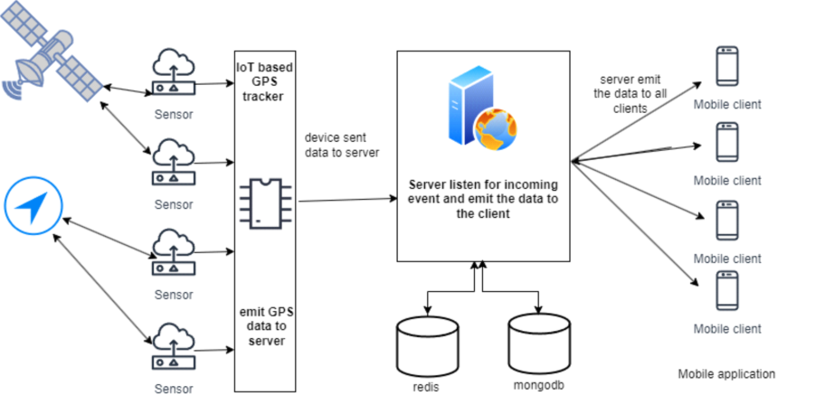
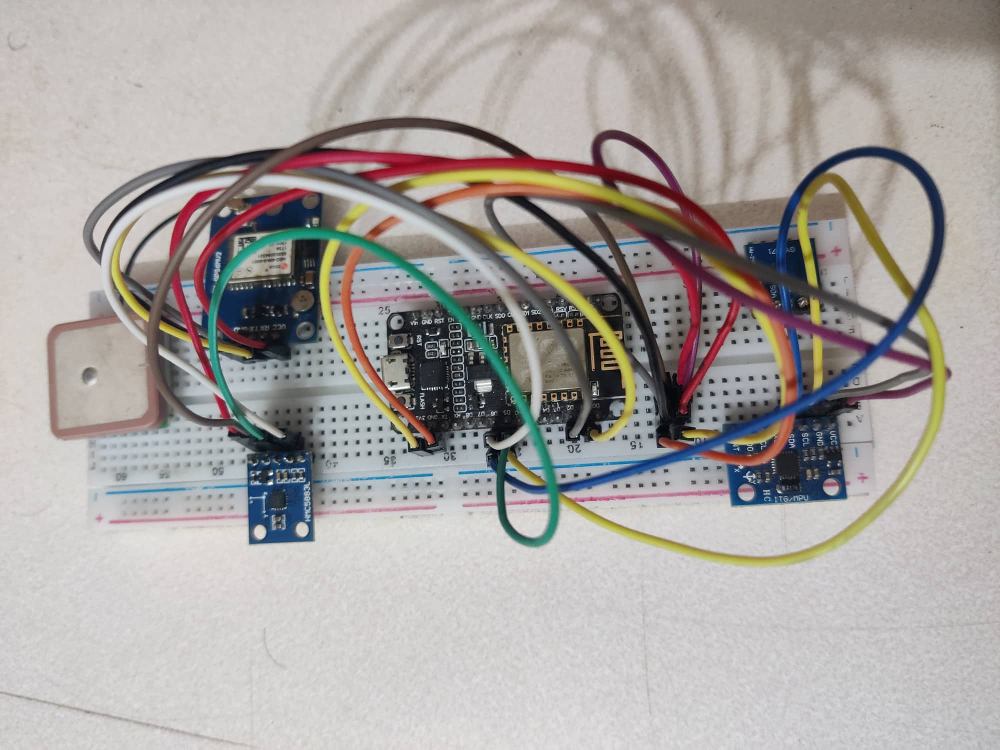

# Real-time Vehicle Tracking

Real-time Vehicle Tracking is a fullstack application that enables users to track the real-time location of vehicles. It uses a combination of technologies, including React Native on the client-side, Node.js, and Express on the server-side, as well as various IoT sensors to collect data. The project leverages Google Maps, Socket.io, Firebase for authentication, MongoDB for data storage, Redis for caching, and IoT sensors, including the Neo6m GPS module, HMC5883L compass, and MPU6050 gyroscope+accelerometer sensor.

## Architecture Screenshots

Here are some architecture screenshots to help you visualize how the Real-time Vehicle Tracking system is structured:
<div style="display: flex; padding-top: 10px">
    
    
</div>

## Table of Contents

- [Features](#features)
- [Tech Stack](#tech-stack)
- [IoT Sensors](#iot-sensors)
- [Getting Started](#getting-started)
- [Installation](#installation)

## Features

- Real-time vehicle location tracking on a map.
- Integration with Google Maps for accurate location visualization.
- Real-time communication between the client and server using Socket.io.
- User authentication powered by Firebase.
- Data storage and retrieval using MongoDB.
- Caching for enhanced performance using Redis.

## Tech Stack

- **Client:**
  - React Native
  - Google Maps
  - Socket.io

- **Server:**
  - Node.js
  - Express
  - Socket.io

- **Databases:**
  - MongoDB (for data storage)
  - Redis (for caching)

- **Authentication:**
  - Firebase

## IoT Sensors

The Real-time Vehicle Tracking system incorporates a set of IoT sensors to collect essential data for accurate tracking and monitoring. These sensors play a vital role in the functionality of the system:

- **Neo6m GPS Module:** The Neo6m GPS module is responsible for collecting precise global positioning data, allowing the system to monitor the real-time location of vehicles.

- **HMC5883L Compass:** The HMC5883L compass sensor is used to determine the vehicle's heading direction, enabling users to visualize the orientation of the vehicle on the map.

- **MPU6050 Gyroscope+Accelerometer Sensor:** The MPU6050 sensor captures data related to the vehicle's acceleration and rotation, providing critical information for tracking the vehicle's movements and stability.

### Libraries

To effectively utilize these IoT sensors and manage the data they generate, the project leverages the following libraries:

- **TinyGPS++:** The TinyGPS++ library is utilized for parsing the data received from the Neo6m GPS module. It simplifies the extraction of location-related information, making it easy to incorporate real-time tracking.

- **ArduinoJson:** ArduinoJson is employed to format and process the sensor data gathered from the HMC5883L compass and MPU6050 sensor. This library ensures that the data is structured and readily accessible for tracking and visualization, enhancing the overall user experience.

By integrating these IoT sensors and libraries into the project, Real-time Vehicle Tracking delivers a comprehensive solution for real-time location monitoring and vehicle orientation, providing users with accurate and reliable information.

## Getting Started

To get started with this project, you'll need to follow these steps:

### Installation

1. Clone the repository:

   ```bash
   git clone https://github.com/mdpabel/Real-time-Vehicle-Tracking

2. Install client dependencies
cd client
npm install

3. Install server dependencies
cd ../server
npm install
